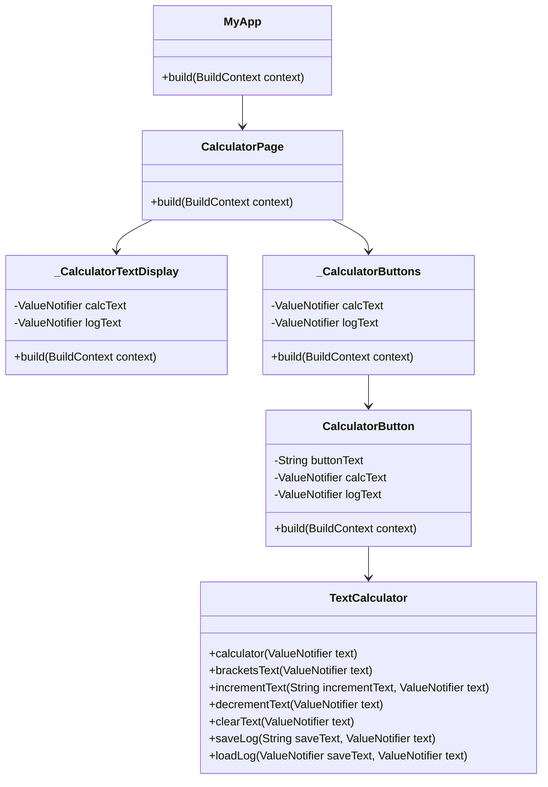
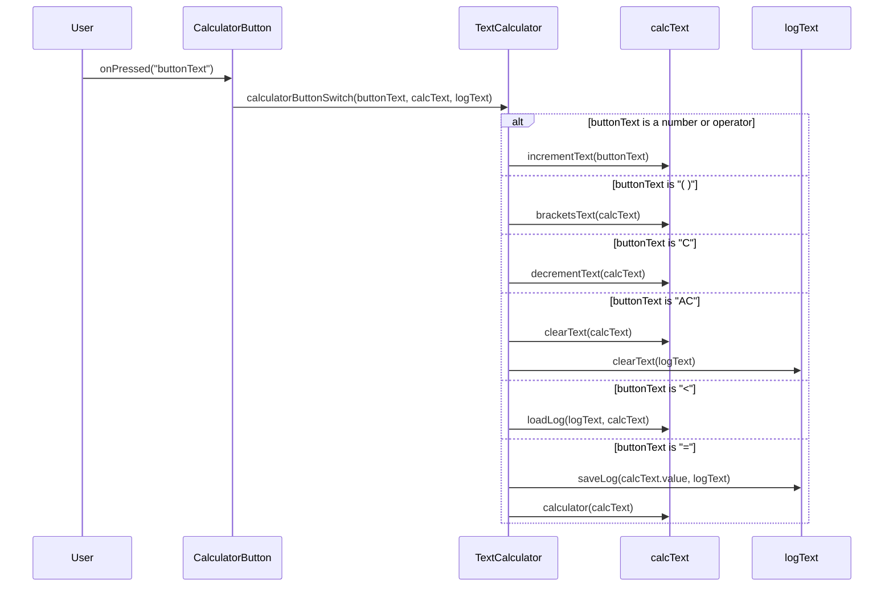

# Flutter-Calculator
  

flutterの学習用に作成したスマートフォン用のシンプルな電卓アプリ

# Note

  
ClassDiagram

  

  
SequenceDiagram

  

# external package
使用した外部パッケージ
- [auto_size_text](https://pub.dev/packages/auto_size_text/install) 文字サイズの自動調整
- [math_expressions](math_expressions) 文字列を計算式として扱う
- [flutter_screenutil](https://pub.dev/packages/flutter_screenutil) 画面サイズをdp単位で調整
